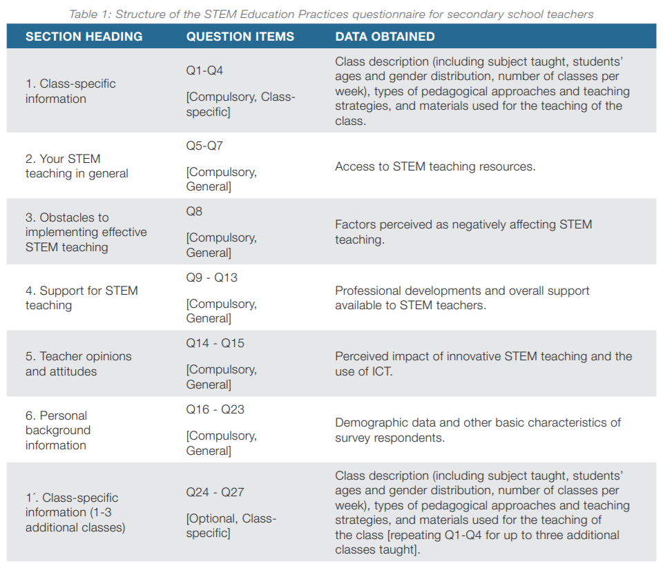

# SCIENTIX: Science Edcuation in Europe Dataset

This dataset contains responses from teachers to the survey on STEM Education Practices Survey organised in 2018, looking to collect information about how STEM teachers throughout Europe organise their teaching practices. The survey that was conducted contained around 30 questions that focused on different facets of teaching. 

## The Dataset

The final dataset contains 3,780 responses in a CSV file. The final dataset is available [here](datasets). 

### Survey Questions
The survey contains 27 questions as described in the table below. 

A copy of the full questionnaire provided to the teachers is found [here](resources/survey_questionnaire.pdf)

## Desired Outcomes

Participants are expected to use the suruvey results to understand the data better. The full report compiled with the 
data is found [here](resources/Scientix-full-resport-2018.pdf). 

However, detailed analysis of data coming from different countries (e.g. like Slovenia, Portugal, France or Italy) 
is not conducted and is very valuable for understanding the data in the local context. 
